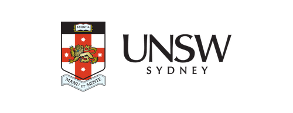

# TRIBOT - Multilingual Emergency Triage Assistant



## 🏥 Overview

TRIBOT is an AI-powered multilingual emergency department triage assistant developed as part of NHMRC-funded research at UNSW Sydney. This prototype bridges cultural and linguistic gaps in healthcare by providing culturally-sensitive medical assessment in multiple languages.

## 🌍 Supported Languages

- **English** 🇺🇸
- **Arabic** 🇸🇦 (العربية)
- **Bangla** 🇧🇩 (বাংলা)
- **Tamil** 🇮🇳 (தமிழ்)
- **Hindi** 🇮🇳 (हिन्दी)

## ✨ Features

### 🤖 AI-Powered Triage
- Intelligent symptom analysis using Azure OpenAI
- Australian Triage Scale (ATS) assessment
- Cultural context awareness
- Confidence scoring and clinical reasoning

### 🗣️ Voice Input Support
- Speech-to-text transcription
- Multi-language voice recognition
- Secure audio processing

### 🌐 Cultural Sensitivity
- Language-specific communication styles
- Family involvement considerations
- Religious and cultural practice awareness
- Culturally-appropriate medical guidance

### 📱 Modern Interface
- Responsive design for all devices
- Real-time chat interface
- Visual triage level indicators
- Comprehensive clinical analysis display

## 🔧 Technology Stack

- **Frontend**: React 18 + TypeScript
- **Styling**: Tailwind CSS
- **Icons**: Lucide React
- **AI Service**: Azure OpenAI (GPT-4)
- **Voice**: Azure Whisper API
- **Build Tool**: Vite
- **Deployment**: Bolt Hosting

## 🚀 Getting Started

### Prerequisites

- Node.js 18+ and npm
- Azure OpenAI API access
- Azure Whisper API access (optional, for voice features)

### Installation

1. **Clone the repository**
   ```bash
   git clone https://github.com/yourusername/tribot-multilingual-triage.git
   cd tribot-multilingual-triage
   ```

2. **Install dependencies**
   ```bash
   npm install
   ```

3. **Configure environment variables**
   
   Copy `.env.example` to `.env` and fill in your Azure credentials:
   ```bash
   cp .env.example .env
   ```
   
   Required variables:
   ```env
   VITE_OPENAI_API_KEY=your_azure_openai_api_key
   VITE_OPENAI_BASE_URL=https://your-resource.openai.azure.com
   VITE_OPENAI_API_VERSION=2025-01-01-preview
   VITE_DEPLOYMENT_NAME=gpt-4o
   
   # Optional - for voice features
   VITE_WHISPER_API_KEY=your_whisper_api_key
   VITE_WHISPER_API_ENDPOINT=your_whisper_endpoint
   ```

4. **Start development server**
   ```bash
   npm run dev
   ```

5. **Build for production**
   ```bash
   npm run build
   ```

## 🏗️ Project Structure

```
src/
├── components/           # React components
│   ├── ChatHeader.tsx   # Application header
│   ├── ChatInput.tsx    # Message input with voice support
│   ├── ChatMessage.tsx  # Message display with analysis
│   └── WelcomeMessage.tsx # Landing page content
├── services/            # API services
│   ├── openaiService.ts # Azure OpenAI integration
│   └── whisperService.ts # Voice transcription
├── App.tsx             # Main application component
├── main.tsx            # Application entry point
└── index.css           # Global styles
```

## 🔒 Security & Privacy

- **No data storage**: Conversations are not stored permanently
- **Secure API calls**: All AI processing via Azure OpenAI
- **Privacy-first**: Voice data processed securely and not retained
- **Research compliance**: Follows NHMRC research guidelines

## ⚠️ Important Disclaimers

### 🚨 Research Prototype Only
This application is developed for research purposes as part of an NHMRC-funded study. **It is NOT intended for clinical decision-making or real emergency situations.**

### 🏥 Medical Disclaimer
- Always consult qualified healthcare professionals for medical advice
- This tool provides guidance only and should not replace professional medical assessment
- In real emergencies, contact emergency services immediately

### 🔬 Research Context
This prototype is part of ongoing research by **Dr. Padmanesan Narasimhan** at UNSW Sydney, focusing on improving emergency department communication for multilingual patients.

## 👨‍💻 Development Team

### Founder & Developer
**MD ABU RAYHAN**
- 📧 Email: m.rayhan@student.unsw.edu.au
- 💼 LinkedIn: [MD ABU RAYHAN](https://www.linkedin.com/in/md-abu-rayhan-854b3b1a9/)
- 🎓 UNSW Sydney

### Research Supervisor
**Dr. Padmanesan Narasimhan**
- 🏛️ UNSW Sydney
- 💰 NHMRC Research Grant

## 📄 License

This project is developed for research purposes under NHMRC funding. Please contact the development team for usage permissions.

## 🤝 Contributing

This is a research prototype. For collaboration opportunities or research inquiries, please contact the development team.

## 📞 Support

For technical issues or research collaboration:
- 📧 Email: m.rayhan@student.unsw.edu.au
- 🏛️ Institution: UNSW Sydney
- 🔬 Research Context: NHMRC-funded study

---

**© 2024 UNSW Sydney. Research prototype developed under NHMRC funding.**